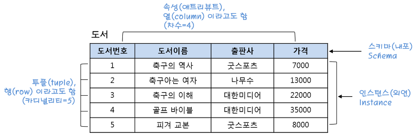

# SQL studies

SQL 이론과 실습 내용을 담았습니다.

## 🧐디렉토리 안내
### [basic](https://github.com/crosstar1228/SQL_study/tree/main/basic) : 기본 명령어를 담았습니다.
### [hands-on](https://github.com/crosstar1228/SQL_study/tree/main/hands_on) : 실습 파일을 담았습니다.

## 📌SQL이란? 
- structured query language의 약자로서, **관계형 데이터베이스**의 대표적인 쿼리 언어입니다.
- table의 형태로 row, column을 확인하고 여러 데이터 분석 진행 가능합니다.
- **데이터 분석에 이용되는 대표적인 언어**이기에 매우 중요!

## ✏ 관계형 데이터베이스란?

릴레이션: 행과 열로 구성된 테이블

속성(Attribute): 세로 값으로 열(Column)이라고도 한다.

튜플(Tuple): 가로 값으로 행(Row)이라고도 한다.

차수: 속성의 수

카디날리티: 튜플의 수

인스턴스: 정의된 스키마에 따라 테이블에 실제 저장된 데이터의 집합

스키마: 릴레이션이 어떻게 구성되는지, 어떤 정보를 담고 있는지에 대한 기본적인 구조를 정의(첫 행 헤더)

출처: https://mangkyu.tistory.com/21 [MangKyu's Diary]

